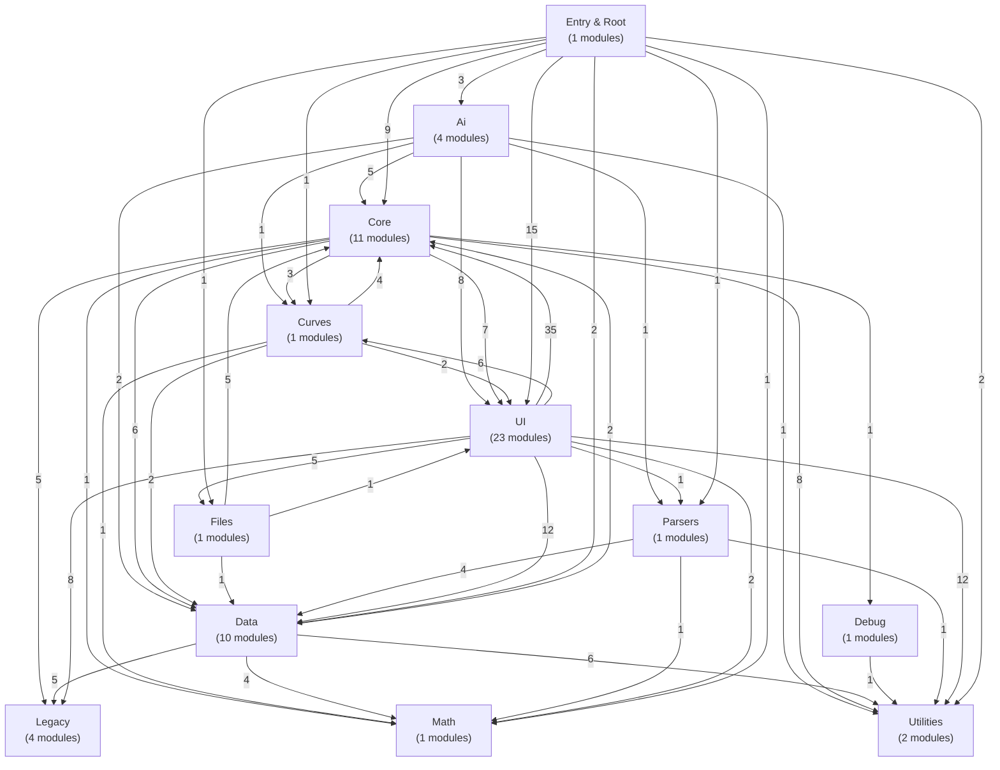

# quadGEN Architecture Map

Generated on 2025-10-01T17:23:43.428Z

This diagram groups source modules by their primary directory and highlights cross-cluster dependencies.

## Directory Samples
- **Ai** (4 modules)
  - src/js/ai/ai-actions.js
  - src/js/ai/ai-config.js
  - src/js/ai/ai-functions.js
  - src/js/ai/chat-interface.js
- **Core** (11 modules)
  - src/js/core/processing-pipeline.js
  - src/js/core/history-manager.js
  - src/js/core/state.js
  - src/js/core/state-manager.js
  - src/js/core/validation.js
- **Curves** (1 modules)
  - src/js/curves/smart-curves.js
- **Data** (10 modules)
  - src/js/data/linearization-utils.js
  - src/js/data/processing-utils.js
  - src/js/data/curve-simplification.js
  - src/js/data/lab-legacy-bypass.js
  - src/js/data/lab-legacy-core.js
- **Debug** (1 modules)
  - src/js/debug/debug-make256.js
- **Files** (1 modules)
  - src/js/files/file-operations.js
- **Legacy** (4 modules)
  - src/js/legacy/legacy-helpers.js
  - src/js/legacy/state-bridge.js
  - src/js/legacy/linearization-bridge.js
  - src/js/legacy/intent-bridge.js
- **Math** (1 modules)
  - src/js/math/interpolation.js
- **Parsers** (1 modules)
  - src/js/parsers/file-parsers.js
- **UI** (23 modules)
  - src/js/ui/edit-mode.js
  - src/js/ui/channel-registry.js
  - src/js/ui/status-service.js
  - src/js/ui/ui-hooks.js
  - src/js/ui/chart-manager.js
- **Utilities** (2 modules)
  - src/js/utils/debug-registry.js
  - src/js/utils/browser-env.js
- **Entry & Root** (1 modules)
  - src/main.js
